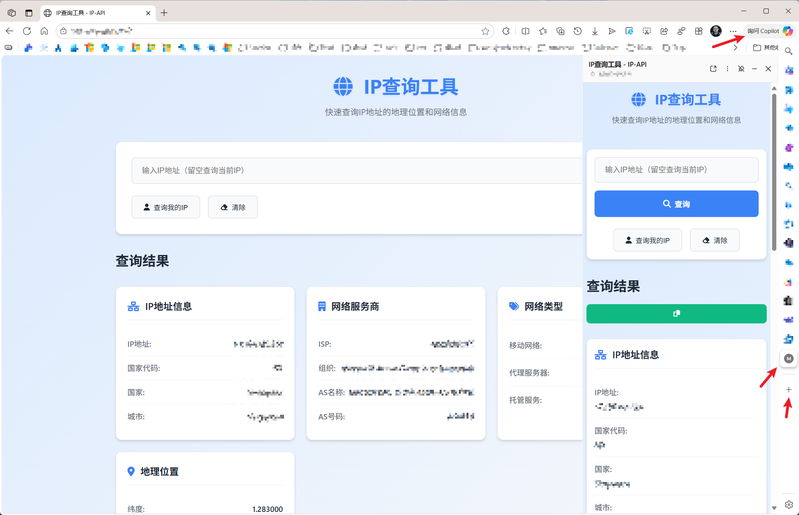

# 🌐 IP-API 查询工具

[](https://developer.mozilla.org/en-US/docs/Web/Progressive_web_apps)
[](https://developer.mozilla.org/en-US/docs/Web/CSS/CSS_media_queries)
[](LICENSE)

一个基于 Web 的现代化 IP 地址信息查询工具，利用 [IP-API.com](https://ip-api.com) 免费接口提供准确的地理位置和网络信息。

## ✨ 功能特性

### 🎯 核心功能
- **自动IP检测**: 页面加载时自动显示访问者当前IP信息
- **手动IP查询**: 支持输入任意IP地址进行查询
- **详细信息展示**: 默认显示以下关键信息：
  - 🌍 **国家代码** (Country Code)
  - 🏢 **所属程序** (Program/Service)
  - 🌐 **ISP提供商** (Internet Service Provider)
  - 🏛️ **组织信息** (Organization)
  - 📡 **AS名称** (Autonomous System Name)
  - 📱 **移动网络** (Mobile Network Detection)
  - 🖥️ **托管服务** (Hosting Service Detection)

### 🚀 技术特性
- **PWA支持**: 可作为原生应用安装到桌面和移动设备
- **Edge边栏兼容**: 完美适配Microsoft Edge浏览器边栏工具
- **响应式设计**: 自适应各种屏幕尺寸和分辨率
- **现代UI**: 采用现代Web设计风格，美观易用
- **跨平台**: 支持Windows、macOS、Linux、iOS、Android等平台
- **离线缓存**: Service Worker提供离线访问能力

## 🖥️ 界面预览



## 📁 项目结构

```
IPAPI/
├── api                 # SWA API Support
├── index.html          # 主页面
├── css/
│   └── style.css       # 样式文件
├── js/
│   └── app.js          # 主要功能逻辑
├── icons/              # PWA图标
│   ├── PLACEHOLDER.md  # 所需图标文件
├── manifest.json       # PWA配置文件
├── sw.js               # Service Worker
└── README.md           # 项目说明
```

## 🔧 技术栈

- **前端**: HTML5, CSS3, Vanilla JavaScript
- **API**: [IP-API.com](https://ip-api.com) 免费版
- **PWA**: Web App Manifest + Service Worker
- **设计**: 响应式布局，现代UI设计

## 📊 API限制

使用 IP-API.com 免费版，具有以下限制：
- **请求频率**: 45次/分钟
- **月度配额**: 1,000次/月
- **支持协议**: HTTP/HTTPS
- **响应格式**: JSON

## 🌟 使用场景

- **网络管理员**: 快速查询IP地址归属信息
- **开发者**: 调试网络相关应用
- **安全分析**: 分析可疑IP来源
- **个人用户**: 了解自己的网络信息
- **教育培训**: 网络知识学习工具

## 🔄 更新日志

### v1.0.0 (2024-03-XX)
- ✅ 基础IP查询功能
- ✅ PWA支持
- ✅ 响应式设计
- ✅ Service Worker缓存
- ✅ 自动IP检测

---

<div align="center">
  Made with ❤️ by gOxiA
</div>